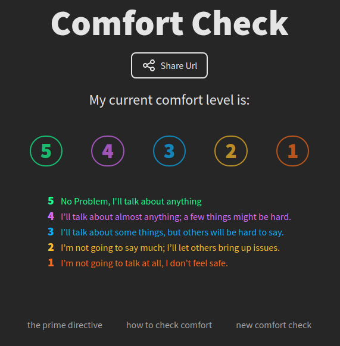

# Comfort Check

(this fork implements this application in google cloud instead of AWS)

This is a little serverless web app we use to facilitate [comfort checks](https://www.funretrospectives.com/safety-check/) for our internal retrospectives. All submissions are completely anonymous and are deleted after 48 hours.

It is available for public use [here](https://storage.googleapis.com/comfort-checks/index.html).

## Architecture

The front-end is a simple react app deployed to a stacic cloud hosting bucket. Built with [Vite](https://vitejs.dev/) and styled with [tailwind](https://tailwindcss.com/)

The back-end API is .json files stored in in a static bucket and updated using a simple serverless javascript API function.
## Install

You are welcome to use this [public installation](https://storage.googleapis.com/comfort-checks/index.html) for your own team, but if you'd like to spin up your own version, you'll need to:

1. Set up an cloud storage bucket with public-read access, CORS enabled, and an auto-deletion policy for `data/` objects
2. Update the package.json to deploy to your own bucket
3. Update 'lambdaAddress' and 'bucketAddress' in utils.js to read from that bucket, and to send updates to your lambda's http address

## Usage

Back end deploy: `npm run deploy:api`

Front end deploy: `npm run deploy:app`

Local API test: `npm run test:handler`

Local App server: `npm run dev`
